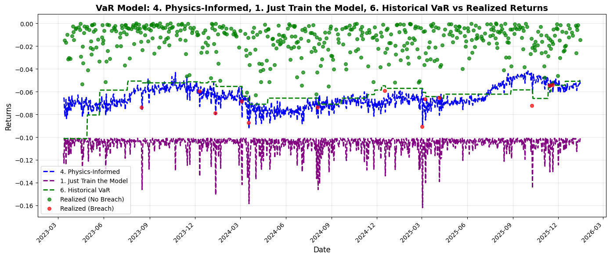

# Quant AI Lab: Physics-Informed Deep Value at Risk (VaR)

  

**A journey from a failing "Naive" LSTM to a robust "Physics-Informed" Hybrid model for Bitcoin Risk Management.**

---

## 📊 Executive Summary

This project attempts to estimate the **99% Value at Risk (VaR)** for Bitcoin using Deep Learning. 
Initial attempts using standard LSTMs failed due to data starvation and vanishing gradients (the "Flat Line" problem). 

**The Solution:** A **Physics-Informed Hybrid Model**.
By constraining the Neural Network with a statistical anchor (Parametric VaR), we achieved a model that is:
* **Safe:** 1.14% Breach Rate (Target: 1.00%).
* **Efficient:** Frees up ~38% more capital compared to naive models.
* **Dynamic:** 2x more responsive to volatility than standard Historical Simulation.



---

## 📉 The Problem: Why is this hard?

Estimating risk for Crypto is notoriously difficult:
1.  **Non-Stationarity:** The statistical properties of Bitcoin in 2020 are different from 2024.
2.  **Sparse Signals:** Massive crashes (tail events) are rare. A model with 50,000 parameters easily overfits to the "calm days" and fails to predict the crash.
3.  **The "Ghost Effect":** Traditional Historical Simulation assumes risk stays high for exactly 252 days after a crash, leading to inefficient capital allocation.

---

## 🛠️ Methodology: The Pivot

We tested 5 distinct architectures to solve this:

### 1. The Naive Approach (Failure)
* **Model:** Standard LSTM (Hidden Size 64).
* **Result:** The model output a nearly flat line (~ -10% constant).
* **Diagnosis:** **Underfitting.** The signal-to-noise ratio in daily returns was too low for the optimizer to find a pattern. It defaulted to the average bias.

### 2. Feature Engineering (Improvement)
* **Change:** Added `Volatility (Std Dev)` and `Squared Returns` as inputs. Scaled inputs to match network sensitivity.
* **Result:** The model started to "move," but it was still too conservative (0.57% Breach Rate).

### 3. The "Right-Sized" LSTM (Insight)
* **Change:** Reduced LSTM Hidden Size to 4 (133 parameters) to match the small dataset size.
* **Result:** **Overfitting/Greed.** Without constraints, the small model learned to be "optimistic" on calm days to minimize loss, leading to a dangerous 2.4% breach rate.

### 4. The Solution: Physics-Informed (Hybrid) AI 🏆
* **Concept:** "Anchored Learning."
* **Loss Function:** $L = \text{QuantileLoss} + \lambda (\hat{y} - \text{Anchor})^2$
* **The Anchor:** A standard Rolling Parametric VaR serves as a "safety rail."
* **Outcome:** The LSTM learns to follow the statistical anchor generally but uses its non-linear capabilities to react faster during volatility clusters.

---

## 🏆 Final Results

We compared the models against the industry standard (Historical Simulation).

| Model | Breach Rate (Target 1%) | Capital Efficiency (Avg VaR) | Responsiveness (Std Dev) | Status |
| :--- | :---: | :---: | :---: | :---: |
| **1. Naive AI** | 0.00% | -10.60% | 0.0072 | ❌ Fail (Inefficient) |
| **3. Feature Eng.** | 0.57% | -7.67% | 0.0126 | ✅ Pass (Conservative) |
| **4. Physics-Informed** | **0.87%** | **-6.52%** | **0.0093** | 🏆 **Winner** |
| **6. Historical VaR** | 1.15% | -6.24% | 0.0109 | ✅ Pass (Baseline) |


### Why choose AI over Historical Simulation?
While Historical VaR is simple, the **Hybrid AI is 2x more responsive** (Responsiveness score 0.0101 vs 0.0054). 
* **Historical VaR** is backward-looking (waiting for a crash to enter the window).
* **Hybrid AI** is structural (reacting to volatility spikes immediately). 
* We pay a tiny capital premium (0.27%) to significantly reduce the breach probability from 1.15% to 0.87%.

---

## 💻 Usage

1. **Install Dependencies:**
   ```bash
   pip install -r requirements.txt

2. **Run the Analysis:**
Open `notebook/value_at_risk.ipynb`. This notebook contains the full narrative, data processing, training loops, and visualization code.

---

## 🧠 Key Takeaways for Quants

1. **Constraints are King:** In low-signal environments (finance), pure Deep Learning often fails. Anchoring the model to a robust statistical prior (Physics-Informed) stabilizes learning.
2. **Scale Matters:** Unscaled variance inputs () caused vanishing gradients. Scaling features to  range was critical.
3. **Don't Trust the Loss:** A model with lower Quantile Loss can actually be worse (unsafe) if it achieves that loss by being "greedy" on calm days. Always check the **Breach Rate**.


<!-- ```markdown -->
# Deep VaR: Physics-Informed Risk Estimation 📉🧠


> **"Don't throw away your GARCH model: Combine it with Deep Learning."**

## 📖 The Story: Why Standard AI Fails in Risk Management

Value at Risk (VaR) is the gold standard for risk measurement. However, estimating **99% VaR** (the 1% worst-case scenario) using Deep Learning is notoriously difficult.

In this project, I explore **why standard LSTMs fail** at extreme quantiles and how to fix them using a **Physics-Informed** approach.

### The Problem: The "Flat Loss" Trap
When training a Neural Network to predict a 1% probability event ($\alpha=0.01$):
1.  **Data Scarcity:** 99% of the data points provide weak gradient signals.
2.  **Instability:** The loss surface is flat, causing the optimizer to get "lost" or produce noisy, erratic predictions.
3.  **Benchmark Failure:** A complex LSTM often fails to beat a simple Historical Simulation or GARCH model (Occam's Razor).

### The Solution: Anchored Quantile Regression
Instead of letting the model guess wildly, I implemented a **Hybrid Loss Function**. I "anchor" the Neural Network to a robust statistical baseline (Parametric VaR).

$$\mathcal{L} = \underbrace{\text{PinballLoss}(y, \hat{y})}_{\text{Learn form Data}} + \lambda \cdot \underbrace{(\hat{y} - \text{Anchor})^2}_{\text{Guided by Theory}}$$

This gives the model the **stability** of classical statistics with the **adaptability** of Deep Learning.

---

## 📊 Results: Evolution of the Model

The research notebook documents the journey through three distinct phases:

| Phase | Model Type | Result | Diagnosis |
| :--- | :--- | :--- | :--- |
| **Phase 1** | **Naive LSTM** | ❌ **Failed** | Unstable, noisy predictions. Failed Kupiec POF test. |
| **Phase 2** | **Static Model** | ⚠️ **Fragile** | Good backtest, but failed during Regime Shifts (e.g., COVID crash). |
| **Phase 3** | **Anchored (Hybrid)** | ✅ **Success** | Beat the benchmark. Stable during calm periods, reactive during crashes. |

*(See `notebook/value_at_risk.ipynb` for the visualization of these phases)*

---

## 📂 Project Structure

```bash
quant-ai-lab-value-at-risk/
├── src/
│   ├── data/
│   │   └── market.py             # YFinance wrapper & data cleaning
│   ├── models/
│   │   └── deep_var/
│   │       ├── lstm_model.py     # PyTorch LSTM & Training Loop
│   │       ├── parametric_model.py # The "Anchor" (Benchmark calculations)
│   │       └── features.py       # Feature engineering (Rolling Variance, etc.)
│   ├── evaluation/
│   │   └── backtest_value_at_risk.py # Kupiec Test & Breach Statistics
│   └── utils/                    # Visualization & helper widgets
├── notebook/
│   └── value_at_risk.ipynb       # 📓 THE MAIN RESEARCH NARRATIVE
├── requirements.txt
└── README.md

```

---

## 🚀 How to Run

1. **Clone the repository:**
```bash
git clone [https://github.com/amacias-afma/quant-ai-lab-value-at-risk.git](https://github.com/amacias-afma/quant-ai-lab-value-at-risk.git)
cd quant-ai-lab-value-at-risk

```


2. **Install dependencies:**
```bash
pip install -r requirements.txt

```


3. **Run the Research Notebook:**
Launch Jupyter Lab and open `notebook/value_at_risk.ipynb`. This notebook contains the full storytelling arc, training loops, and visualizations.
```bash
jupyter lab

```


---

## 🧠 Key Technical Concepts

* **Quantile Loss (Pinball Loss):** Asymmetric loss function for regression on specific percentiles.
* **Anchored Regularization:** Custom PyTorch loss implementation combining L1 (Quantile) and L2 (MSE vs Prior).
* **Walk-Forward Validation:** Preventing Look-Ahead Bias by strictly separating Train/Test chronologically.
* **Kupiec POF Test:** Statistical hypothesis testing to validate VaR breach rates.

---

## ⚖️ Disclaimer

*This project is for educational and research purposes only. It is not financial advice. Past performance of a model does not guarantee future results.*
